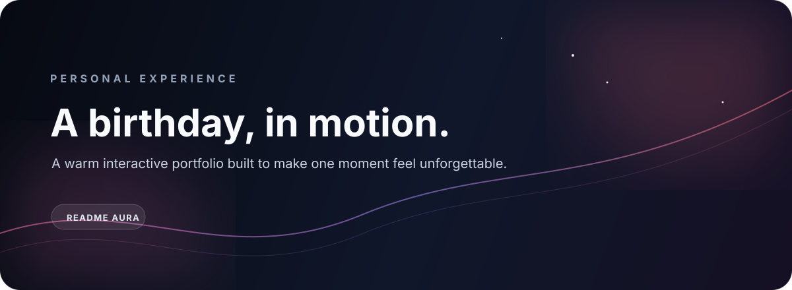

<p align="center"></p>
<p align="center"><a href="https://birthday-portfolio-for-my-sis.vercel.app/">Live experience</a>&nbsp;&nbsp;·&nbsp;&nbsp;<a href="https://github.com/Shoislam0311/Birthday-Portfolio-for-My-Sis">Source</a>&nbsp;&nbsp;·&nbsp;&nbsp;<a href="MOBILE_COMPATIBILITY.md">Mobile notes</a></p>

> A small digital world built for one very important person.

## The feeling

This is not a generic landing page. It is a responsive birthday portfolio designed as a personal celebration: a visual journey with thoughtful sections, interactive wishes, soft motion, and enough warmth to feel made rather than assembled.

## The experience map

| Moment | What happens |
|:--|:--|
| **Arrival** | A focused hero introduces the celebration without visual noise. |
| **Memory** | Editorial sections create space for messages, images, and personal detail. |
| **Interaction** | Motion, dialogs, cards, and responsive transitions turn browsing into participation. |
| **Keep** | The final experience remains comfortable on mobile, tablet, and desktop. |

## Built with

`React` · `TypeScript` · `Vite` · `Tailwind CSS` · `Radix UI` · `Framer Motion` · `Embla Carousel` · `Lucide React` · `Sonner`

## Run it locally

```bash
pnpm install
pnpm dev
```

For a production check:

```bash
pnpm build
```

## Design language

The interface favors a warm visual rhythm, strong type scale, generous spacing, and motion that supports the story instead of interrupting it. Keep the existing component vocabulary when extending the page; new dependencies should earn their place.

## Continue the work

Read [CONTRIBUTING.md](CONTRIBUTING.md) before changing the experience and review [MOBILE_COMPATIBILITY.md](MOBILE_COMPATIBILITY.md) whenever a layout, breakpoint, dialog, carousel, or interaction changes.

<p align="center"><sub>Made with intention, not a template.</sub></p>
